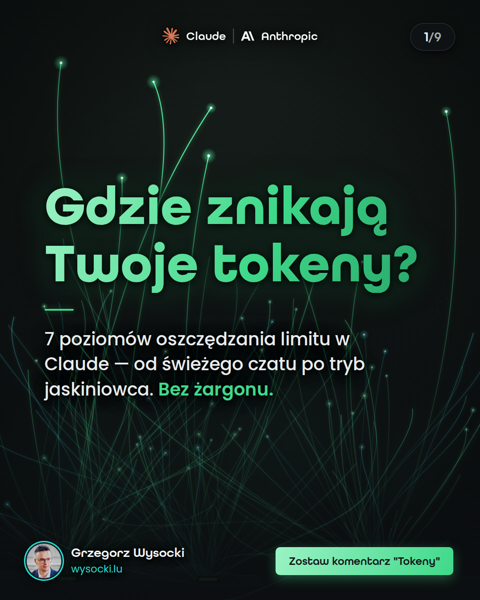
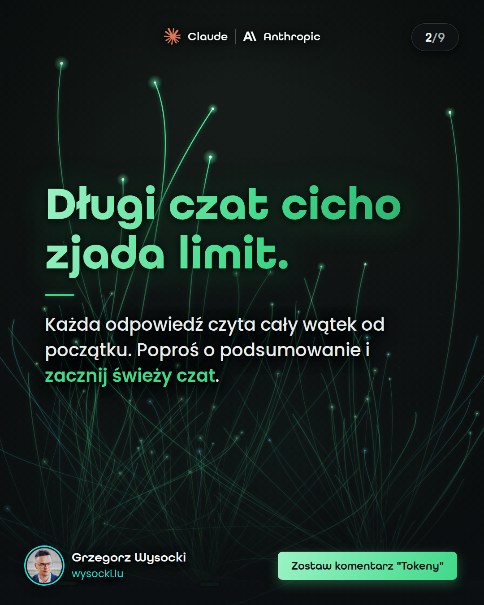
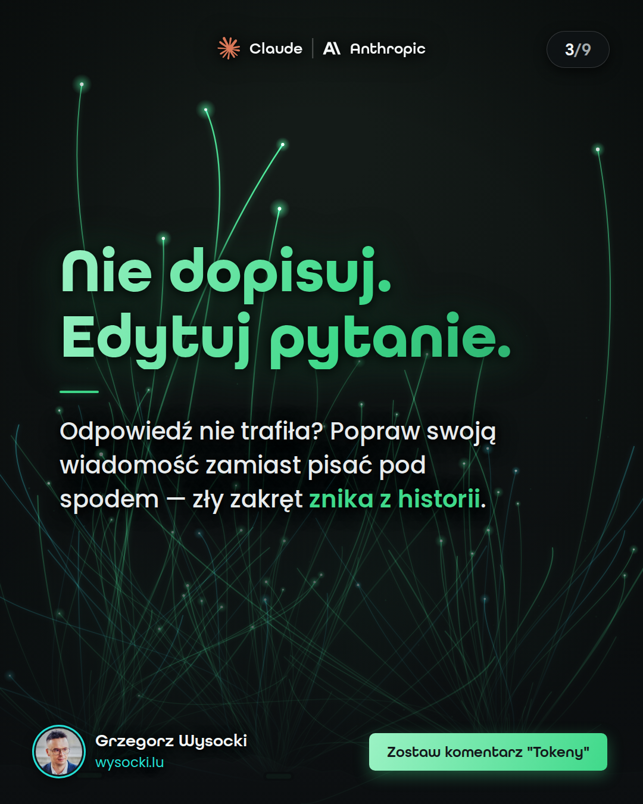
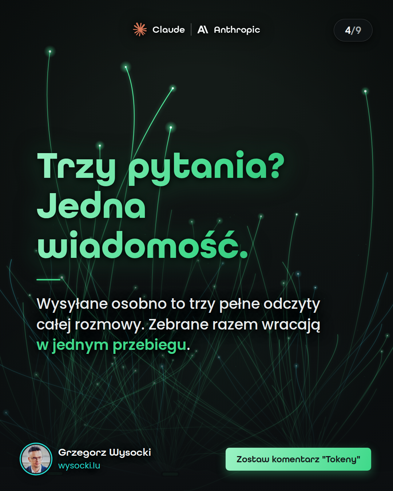
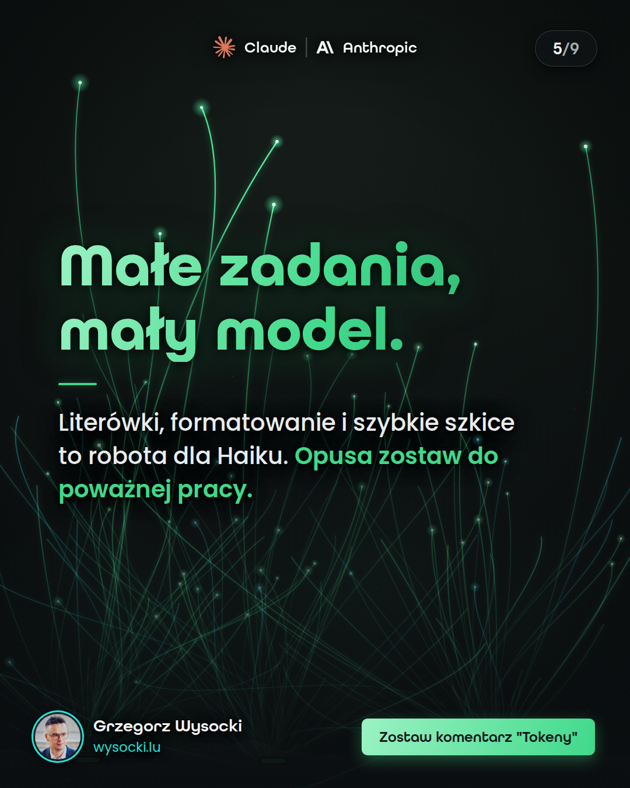
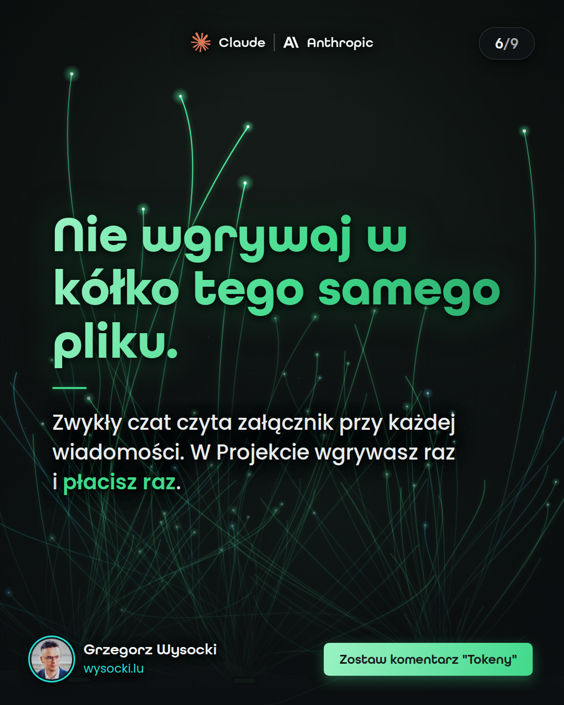
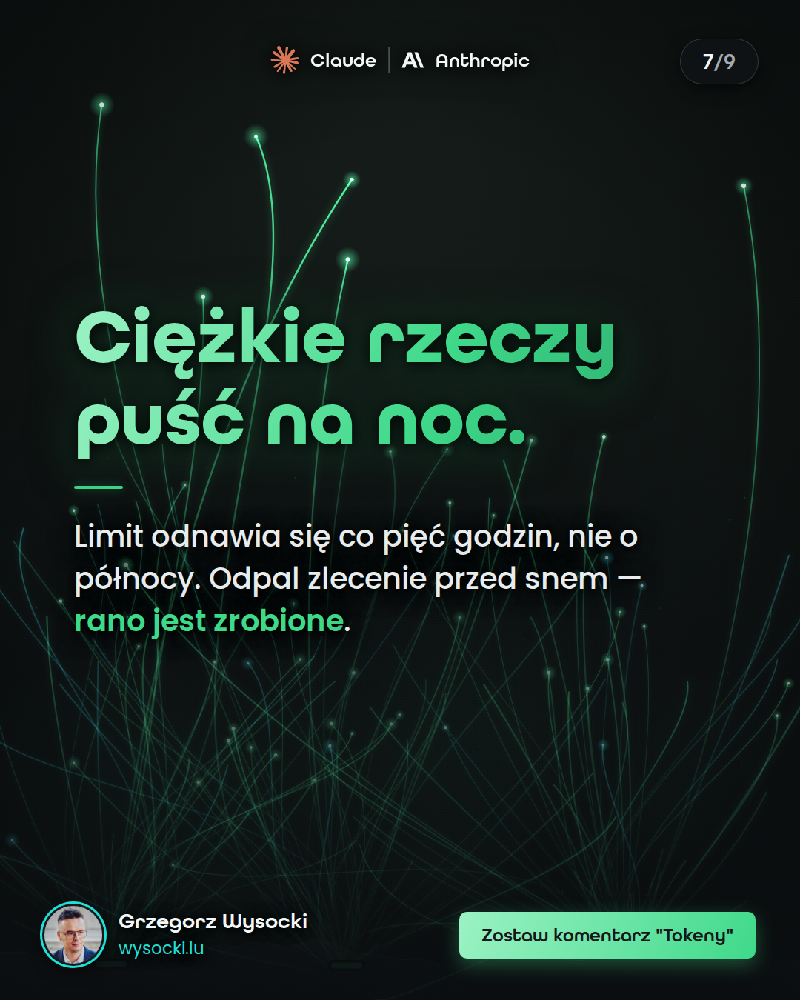
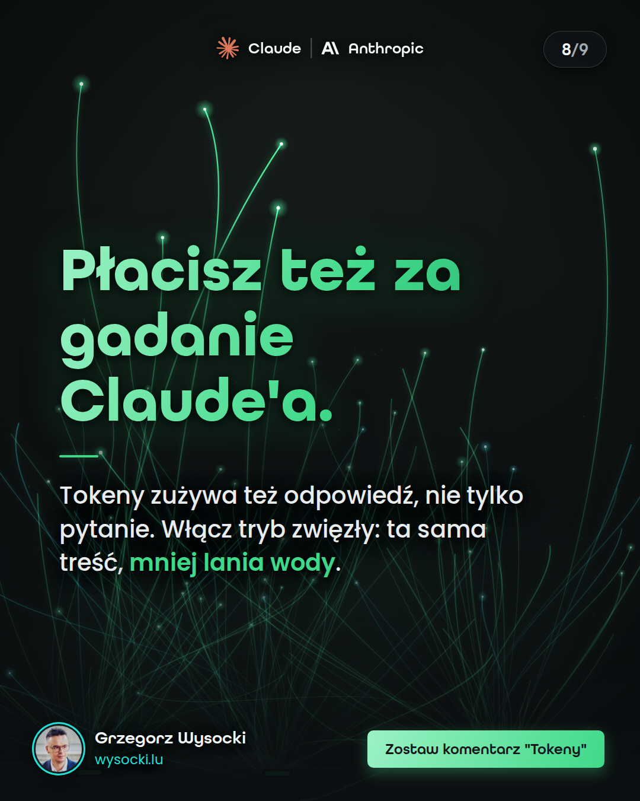
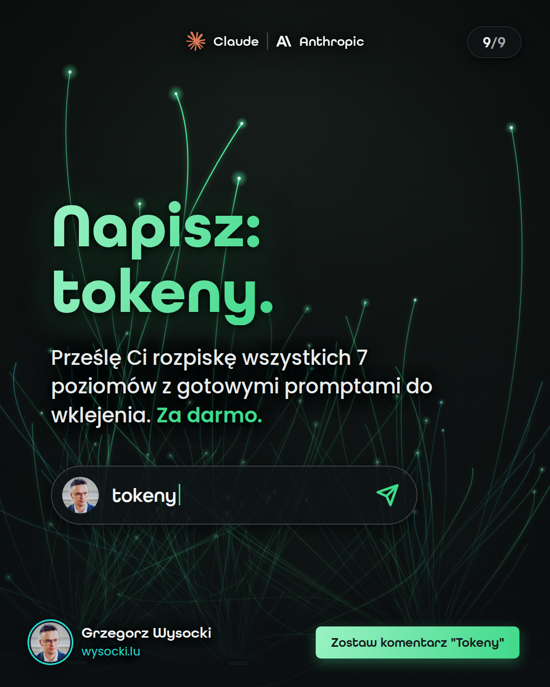

# Karuzela „Tokeny" — 7 poziomów oszczędzania limitu w Claude · wysocki.lu

**Podgląd tymczasowy** (gałąź `podglad-tokeny`, do skasowania po publikacji). 9 slajdów · 1080×1350 (4:5) · akcent mięta `#3FD98A`.

**Zapis na telefonie:** stuknij w obrazek (otworzy się pełny PNG) → przytrzymaj → „Zapisz do zdjęć". Wrzucaj w kolejności 1→9.

| | |
|---|---|
| **1 · Okładka** | **2 · Poziom 1 — nowy czat** |
| [](https://raw.githubusercontent.com/gwysocki-dot/kregoslup/podglad-tokeny/out-tk/slajd-tk-s1.png) | [](https://raw.githubusercontent.com/gwysocki-dot/kregoslup/podglad-tokeny/out-tk/slajd-tk-s2.png) |
| **3 · Poziom 2 — edycja** | **4 · Poziom 3 — paczka** |
| [](https://raw.githubusercontent.com/gwysocki-dot/kregoslup/podglad-tokeny/out-tk/slajd-tk-s3.png) | [](https://raw.githubusercontent.com/gwysocki-dot/kregoslup/podglad-tokeny/out-tk/slajd-tk-s4.png) |
| **5 · Poziom 4 — modele** | **6 · Poziom 5 — projekty** |
| [](https://raw.githubusercontent.com/gwysocki-dot/kregoslup/podglad-tokeny/out-tk/slajd-tk-s5.png) | [](https://raw.githubusercontent.com/gwysocki-dot/kregoslup/podglad-tokeny/out-tk/slajd-tk-s6.png) |
| **7 · Poziom 6 — nocna zmiana** | **8 · Poziom 7 — tryb jaskiniowca** |
| [](https://raw.githubusercontent.com/gwysocki-dot/kregoslup/podglad-tokeny/out-tk/slajd-tk-s7.png) | [](https://raw.githubusercontent.com/gwysocki-dot/kregoslup/podglad-tokeny/out-tk/slajd-tk-s8.png) |
| **9 · CTA** | |
| [](https://raw.githubusercontent.com/gwysocki-dot/kregoslup/podglad-tokeny/out-tk/slajd-tk-s9.png) | |

## Opis posta (skopiuj)

```text
Limit w Claude AI znika Ci szybciej, niż powinien? Ta karuzela pokazuje, gdzie naprawdę uciekają tokeny — i jak je zatrzymać. 👇

7 poziomów oszczędzania limitu w Claude — od świeżego czatu po tryb jaskiniowca. Te same efekty, mniejsze zużycie. Bez żargonu.

1️⃣ Nowy czat — długa rozmowa czyta się od początku przy każdej odpowiedzi
2️⃣ Edycja — poprawiaj pytanie zamiast dopisywać pod spodem
3️⃣ Paczka — trzy pytania w jednej wiadomości zamiast trzech osobno
4️⃣ Modele — małe zadania oddaj małemu modelowi (Haiku zamiast Opusa)
5️⃣ Projekty — nie wgrywaj w kółko tego samego pliku
6️⃣ Nocna zmiana — limit odnawia się co 5 godzin, ciężkie zlecenia puść na noc
7️⃣ Tryb jaskiniowca — płacisz też za odpowiedzi, tnij lanie wody

Zapisz post 🔖 i testuj jeden poziom dziennie.

Napisz w komentarzu „TOKENY”, a prześlę Ci pełną rozpiskę z gotowymi promptami do wklejenia. Za darmo.

#claudeai #claude #anthropic #sztucznainteligencja #aitools #narzedziaai #produktywnosc #aipoludzku
```

---

Docelowe miejsce galerii po deployu strony: https://wysocki.lu/relacje-ig/galeria-tokeny.html
